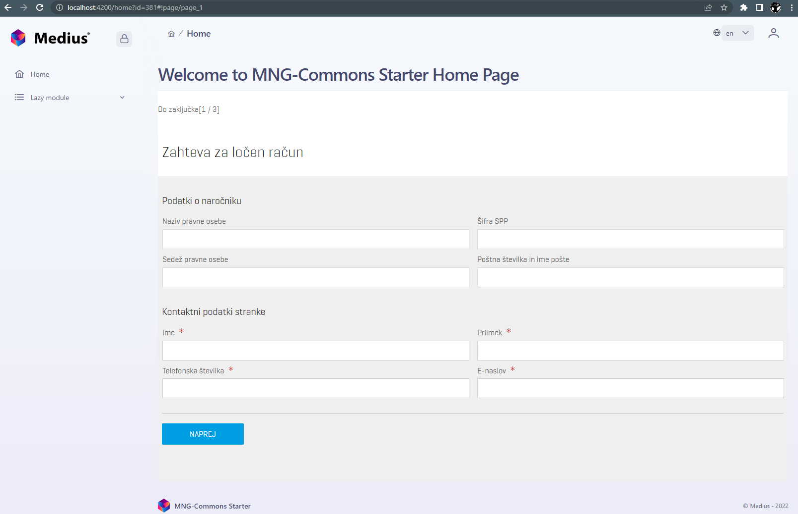

# Embedding Forms into Angular



_Step 1: index.html_  
Add CSS import statement into `<head>` tag.

```html
<link rel="stylesheet" type="text/css" href="http://ts-forms-front-sb1.apps.ocp-test.ts.telekom.si/forms/VAADIN/themes/valo-littea-tip/compiled-valo-littea-tip.css?v=1.0.120">
```

_Step 2: assets_  
Download file [vaadinBootstrap.js](src/assets/vaadinBootstrap.js)  
to angular `src/assets` directory

_Step 3: vaadinBootstrap.js_  
Add code (forms configuration) snippet on the bottom of the `vaadinBootstrap.js` file
```js
if (!window.vaadin)
    alert("Failed to load the bootstrap JavaScript");

/* The UI Configuration */
vaadin.initApplication("forms", {
    "browserDetailsUrl": "forms/app?embedded=true",
    "serviceUrl": "/forms/app",
    "widgetset": "com.vaadin.DefaultWidgetSet",
    "theme": "valo-littea-tip",
    "versionInfo": {"vaadinVersion": "7.7.17"},
    "vaadinDir": "forms/VAADIN/",
    "heartbeatInterval": 15,
    "debug": false,
    "standalone": false,
    "authErrMsg": {
        "message": "Zapišite si vse neshranjene podatke " +
            "za nadaljevanje <u>kliknite tukaj<\/u>.",
        "caption": "Napaka pri avtentikaciji"
    },
    "comErrMsg": {
        "message": "Zapišite si vse neshranjene podatke " +
            "za nadaljevanje <u>kliknite tukaj<\/u>.",
        "caption": "Napaka pri povezavi"
    },
    "sessExpMsg": {
        "message": "Zapišite si vse neshranjene podatke " +
            "za nadaljevanje <u>kliknite tukaj<\/u>.",
        "caption": "Seja je potekla"
    }
});//]] >
```

_Step 4: proxy.conf.json_   
Create file named `proxy.conf.json` in the angular `src` directory.
```json
{
  "/forms/*": {
    "target": "http://ts-forms-front-sb1.apps.ocp-test.ts.telekom.si",
    "secure": false,
    "changeOrigin": true
  }
}
```

_Step 5: angular.json_
* add script import `src/assets/vaadinBootstrap.js`
```json
      "architect": {
        "build": {
          "options": {
            "scripts": [
                "src/assets/vaadinBootstrap.js"
            ]
            ...
```
* add proxy config
```json
        "serve": {
          "builder": "@angular-devkit/build-angular:dev-server",
          "options": {
              "proxyConfig": "src/proxy.conf.json",
          ...
```

_Step 6: component.html_  
Add forms placeholder div on the desired angular component.
```html
<div id="forms" class="v-app">
    <div class="v-app-loading"></div>
</div>
```

Run `ng serve` and navigate to http://localhost:4200/home?id=381
