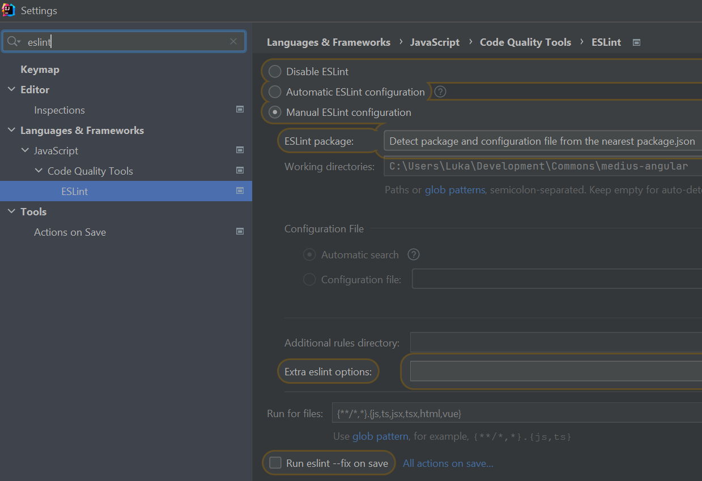
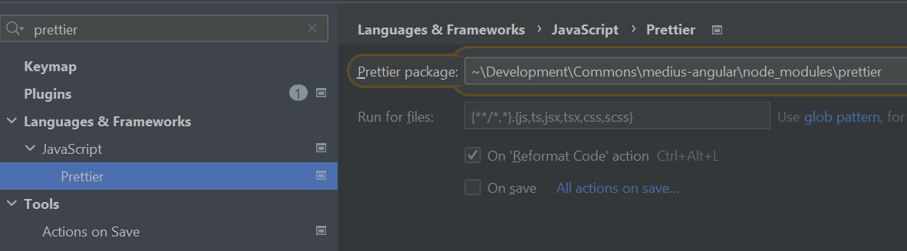

# MNG-COMMONS Starter

Starter projekt s projektno strukturo, ki je pripravljena za uporabo `@mediusinc/mng-commons`.

## Predhodne zahteve

- Node.js (LTS v14 ali LTS v16) in npm
- pnpm package manager (https://pnpm.io/), ki optimizira delovanje privzetega npm in se uporablja na projektih.
- 
## Quick start

1. Ukaz `pnpm install` za namestitev vseh odvisnosti (potrebno ob inicializaciji projekta in spremembah v `package.json` datoteki)
2. Ukaz `pnpm start` - izvede compile Angular projekta in poskrbi za vzpostavitev dev okolja (dev server, watch, recompile on changes)
3. Odpri brskalnik na `https://localhost:4200`

## Build

Ukaz `pnpm build`, projekt se zgradi v `dist` direktorij.

## Splošna priporočila za razvoj Angular projektov

### Strict modes, Lint in Prettier

Opis 4 funkcionalnosti za boljšo programsko kodo, preverjanje in izogibanje napakam.

#### Strict mode (TypeScript in Angular Template)

Na TypeScript projektih se močno priporoča uporaba strict načina za type checking. Podobno funkcionalnost vpeljuje tudi Angular za template-e (HTML). Oboje vklopimo v `tsconfig.json`:

```json
{
  "compilerOptions": {
    "strict": true
  },
  "angularCompilerOptions": {
    "strictTemplates": true
  }
}
```

TypeScript strict mode je močno priporočen tudi na končnih projektih, medtem ko je nujnost strict templateov nižje stopnje, a vseeno priporočena.
Oboje prinaša nekaj "nevščečnosti" pri razvoju, vendar so doprinosi k detekciji napak med razvojem (buildom) in izogibanju napak v runtime-u utemeljeni.

#### Lint

Priporoča se uporaba linterja za preverjanje in izogibanje napakam. Priporoča se uporaba ESLint z razširitvami za TypeScript in Angular.
Lint se najenostavneje doda z `ng lint`, ki od v13 avtomatsko vzpostavi odvisnosti in osnovno konfiguracijo za ESLint. Priporočena konfiguracija `.eslintrc.json` se nahaja na [Consulu](http://config-reg.medius:8500/ui/dc1/kv/default/.eslintrc.json/edit).
Dodatno je potrebno v dev odvisnosti dodati še `@typescript-eslint/eslint-plugin` in `@typescript-eslint/parser`.

ESLint je v priporočeni konfiguraciji nastavljen tako, da upošteva tudi Prettier pravila (več v naslednjem poglavju). Pomembno je, da se za delovanje v dev odvisnosti namesti še `eslint-config-prettier` in `eslint-plugin-prettier`.

ESLint je podprt tudi v IntelliJ, možna konfiguracija na sliki:



Nastavljeno je, da ESLint sledi najbližji najdeni konfiguraciji v izvorni kodi (glede na `package.json`), opcijsko se lahko vklopi popravljanje (_fix_) ob shranjevanju.

#### Prettier

Prettier je orodje za boljše formatiranje izvorne kode, uporaba je priporočena.
Dodamo ga z namestitvijo dev odvisnosti `prettier`, dodatno za sortiranje importov uporabimo še `@trivago/prettier-plugin-sort-imports`. Priporočena konfiguracija `.prettierrc` se nahaja na [Consulu](http://config-reg.medius:8500/ui/dc1/kv/default/.prettierrc/edit).

Prettier je podprt tudi v IntelliJ, možna konfiguracija na sliki:



Smiselno je nastaviti končnice datotek za katere se Prettier uporabi, opcijsko se lahko vklopi formatiranje ob shranjevanju.

### Generiranje modelov iz OpenApi specifikacije

1. Iz API dela pridobimo OpenAPI definicijo in jo prenesemo v direktorij `doc/spec`.
2. (_preskoči pri posodabljanju_) Uredimo generator v datoteki `openapitools.json`, kjer popravimo vhodno OAS specifikacijo:
```json
{
    "$schema": "./node_modules/@openapitools/openapi-generator-cli/config.schema.json",
    "spaces": 2,
    "generator-cli": {
        "version": "5.4.0",
        "generators": {
            "starter-v1": {
                "generatorName": "typescript-node",
                "output": "src/app/core/api/model",
                "glob": "doc/generated-spec/internal-openapi.json",
                "templateDir": "node_modules/@mediusinc/mng-commons/openapi/templates",
                "modelPackage": "generated-sources"
            }
        }
    }
}

```
3. Z ukazom `pnpm run openapi:generate` generiramo modele. V direktoriju `output` (`src/app/core/api/model`) se pojavi nov direktorij `modelPackage`(`src/app/core/api/model/generated-sources`) z avto generiranimi classi. (Oba direktorija sta definirana v `openapitools.json`). Vsebine direktorija `modelPackage NE` spreminjamo!
4. V direktoriju `output (src/app/core/api/model)` posodobimo `mappers.ts` tako, da je vsebina skoraj enaka kot `/output/modelPackage/models.ts` (`src/app/core/api/model/generated-sources/models.ts`). Potrebno je odstraniti razrede/enume, ki so že del commonov (`FilterMatchTypeEnum`, `QueryModeEnum`, `FilterParam`, `QueryParam`) in modele posredovati serializatorju. Lahko copy/paste z odstranitvijo omenjenih razredov in popravljenimi potmi do datotek.
```typescript
import {ObjectSerializer} from '@mediusinc/mng-commons';

const enumsMap: {[index: string]: any} = {
    // ...
};

const typeMap: {[index: string]: any} = {
    // ...
};

ObjectSerializer.get().registerEnums(enumsMap);
ObjectSerializer.get().registerTypes(typeMap);
```
5V `output (src/app/core/api/model)` direktoriju dodamo/posodobimo `index.ts`, kamor dodamo/uredimo exporte iz `models.ts` preko katerih izpostavimo modele, ki jih bomo potrebovali (praviloma tisti, ki jih registriramo v `ObjectSerializer`) v projektu. Lahko copy/paste z odstranitvijo commons razredov in popravljenimi potmi do datotek.

> Modele za `QueryParam` in `QueryResult` `mng-commons` že ima (s predpono `Medius*`). Zgeneriranih ekvivalentov ni potrebno registrirati v `ObjectSerializer`.

### Težave z `node-sass` in `node-gyp`

Predvsem na Windows okoljih lahko pride do težav pri compileu SASS (oz. SCSS) stilov.
Včasih se okolje ne vzpostavi samodejno povsem pravilno ali v celoti, v tem primeru sledi navodilom za ustrezanje prepogojem za delovanje `node-gyp`: https://github.com/nodejs/node-gyp#on-windows
